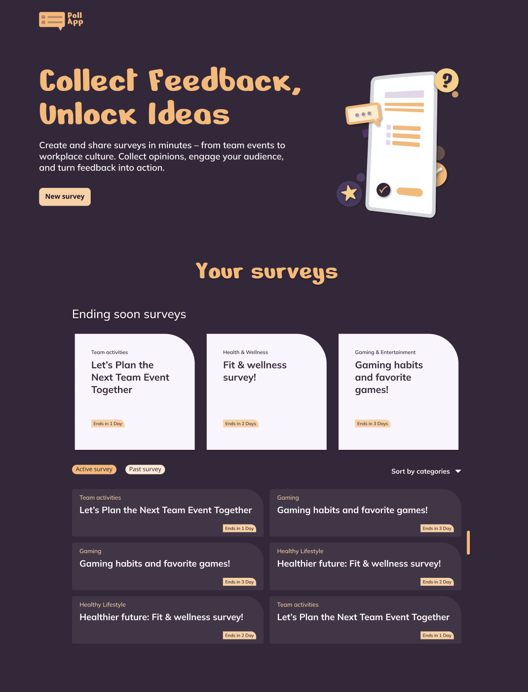

# Poll App

A modern polling application — currently in active development.



## Live Demo

[poll-app.lutz-boelling.de](https://poll-app.lutz-boelling.de)

> Status: Work in progress

## About

Poll App allows users to create and participate in polls. Built with Angular and TypeScript, focusing on a clean component architecture and reactive state management.

## Tech Stack

- Angular
- TypeScript
- SCSS

## Getting Started

```bash
git clone https://github.com/eXactDevFlaw/PollApp.git
cd PollApp
npm install
ng serve
